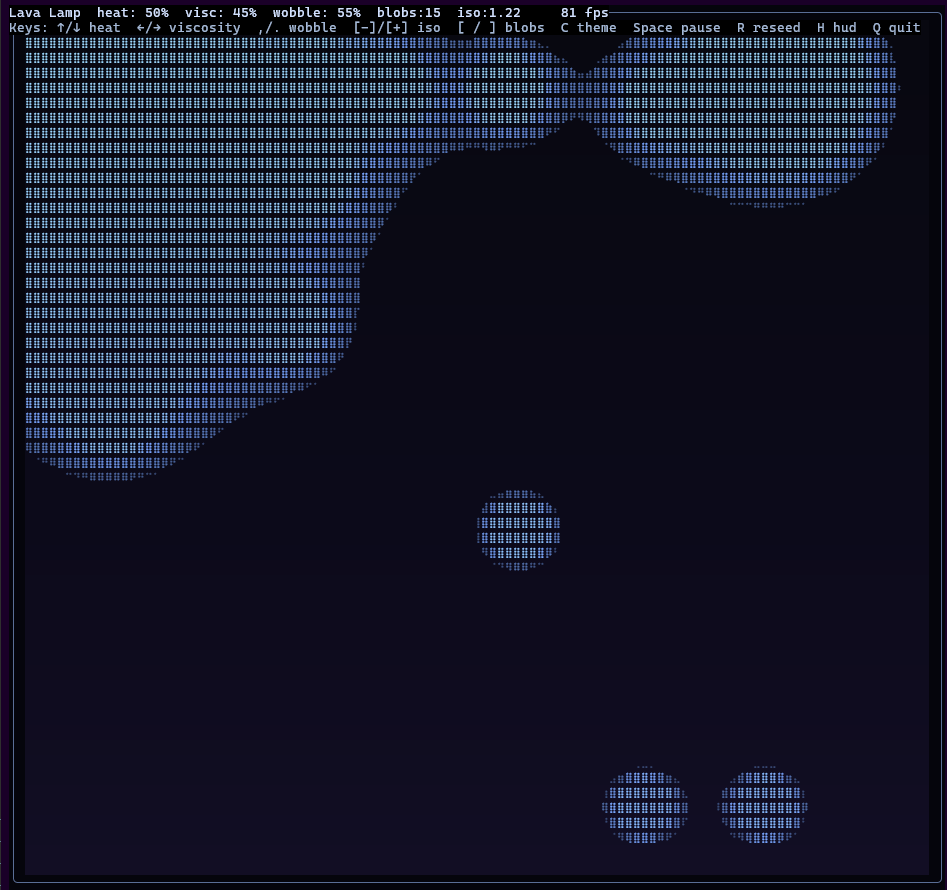
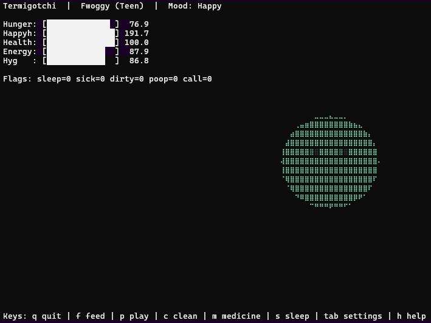

# Terminal Toys

A curated collection of terminal-based Rust applications and simulations that I have made. They are all written in Rust so that they can run in the terminal/command prompt of any OS.

Each subdirectory is a standalone Cargo crate designed to run directly in a modern terminal.

These projects focus on:

- real-time terminal rendering
- ASCII and Braille-based graphics
- interactive simulations and games
- experimentation with terminal performance, input, and animation

## Requirements

Most issues users encounter are related to terminal choice, font support, or Unicode rendering rather than the code itself.

- Rust (stable)
- A UTF-8 capable terminal  
- Recommended terminals: Kitty, Alacritty, Windows Terminal

Some projects use Unicode Braille characters and benefit from truecolor support.

## Installing Rust and Cargo

All projects in this repository are written in Rust and use Cargo, Rust’s build system and package manager.
Cargo is installed automatically when you install Rust using rustup; no separate Cargo installation is required.


### Windows

Download and run rustup-init.exe from:

[https://www.rust-lang.org/tools/install](https://www.rust-lang.org/tools/install)

During installation, choose the default options.

Open Command Prompt or PowerShell and verify:

```sh

rustc --version
cargo --version

```

If both commands print version numbers, installation succeeded.

---

### Linux

Most Linux users should install Rust using rustup (recommended).

```sh

curl --proto '=https' --tlsv1.2 -sSf https://sh.rustup.rs | sh

```

Follow the prompts and accept the default installation.

Then restart your shell and verify:

```sh

rustc --version
cargo --version

```

---

### macOS

*NOTE: There seem to be rendering issues on the Apple Terminal app. I've tested a few of the toys in the Alacritty terminal app without issue. There will need to be some bugfixes in order for some of these toys to run on the default Terminal app.*

Install Command Line Tools if you do not already have them:

```sh

xcode-select --install

```

Install Rust using rustup:

```sh

curl --proto '=https' --tlsv1.2 -sSf https://sh.rustup.rs | sh

```

Restart your terminal and verify:

```sh

rustc --version
cargo --version

```

---

### Updating Rust

If Rust is already installed, update it with:

```sh

rustup update

```

### Troubleshooting

If cargo is not found, ensure ~/.cargo/bin is in your PATH.

On Windows, restart your terminal after installation.

These projects assume stable Rust; nightly is not required.

## Running a project

Each subdirectory in this repository is its own independent Cargo crate and must be run from within that directory.

```sh

cd <project>
cargo run --release

```

## Building a project

```sh

cd <project>
cargo build --release

```


## Projects

### Aquarium  

An interactive, animated aquarium rendered in the terminal, with tweakable parameters.


### Ascii Raymarch  

A real-time ASCII raymarching experiment in the console. User can move around with WASD and look around using the arrow keys.


### Aurora  

A simulation of aurora borealis-style light curtains using terminal graphics, with tweakable parameters.


### Boids  

A classic boids flocking simulation adapted for terminal rendering, with tweakable parameters.


### Cmatrix2  

A Matrix-inspired falling-glyph visualization. Inspired by cmatrix, but attempting to be more faithful to the movies. Alternate color themes, and control of parameters like speed and glyph density.


### Fluidlite Braille  

A fluid simulation rendered using Unicode Braille for higher vertical resolution. You can move the emitter around and add vorticity, etc.


### Fountain  

A particle fountain simulation rendered in the terminal, with tweakable parameters.


### Frogger  

A playable Frogger-style arcade game in the console.


### Grayscott  

A reaction-diffusion (Gray–Scott) simulation visualized in the terminal, with tweakable parameters.


### Lavalamp  

A terminal-based lava lamp simulation with tweakable parameters.



### Lunarlander  

A terminal-based lunar lander game with physics and input control. Surprisingly addictive little game.


### Mazewalker  

A maze navigation and exploration simulation, inspired by a classic Windows screensaver. Foreground and background color of characters can be updated.


### Newton  

A physics-based Newton’s cradle style simulation. Click-clack.


### Orrery  

A planetary or orbital system visualization rendered in the terminal. You can follow specific planets, locked to their orbit, and you can see a rendered view of the planets with facts. This is an extension of the Planetarium code, except no alien glyphs, and with the orbit view.


### Pipes  

A dynamic pipe-routing animation inspired by classic screensavers. You can fly the camera around the pipe simulation, which looks pretty impressive for a TUI application.


### Planetarium  

A rotating planet and celestial visualization with informational overlays, rendered in an "alien language." This idea was further iterated on in the Orrery code.


### Plasmaglobe  

A plasma-style energy globe effect adapted to terminal graphics.


### Retrowave  

An infinite synthwave-style road and horizon animation.


### Starfield  

A 3D starfield flight simulation rendered in the terminal, with tweakable parameters.


### Tenprint  

A continuously generating maze based on the classic 10 PRINT algorithm, with a gradient on the top and bottom that makes the render seem like a rolling cylinder. Various tweakable parameters, including alternate characters and modes.


### Termigotchi  

A Tamagotchi-like digital pet for the terminal. Feed, play, clean, and care for your pet as it grows.




### Termpath  

A terminal-based pathfinding or traversal visualization. Visualizes a few different pathfinding methods like A*.


### Terrarium Braille  

A cellular ecosystem simulation rendered with Braille characters to fake a higher resolution. 


### Unsinkable  

A buoyancy and stability simulation rendered in the terminal. Modeled after a desk toy that uses liquids of different densities.


### Voronoi  

A Voronoi diagram and region growth visualization, with tweakable parameters.


### Weather  

A terminal-based weather visualization and data display tool. Look up the weather using a zip code or lat/lon coordinates. Includes a radar visualization using colored Braille characters. Note: this one takes some args. You can do:
```
cargo run --release -- --zip 90210
cargo run --release -- --country ca --zip "E3A" 
cargo run --release -- --lat 30.350874752934484 --lon -81.70865176410668 
```
The "--" flag on its own lets you provide args.
If you build the program, you can use args normally, like:
```
weather --zip 90210
weather --country ca --zip "E3A" 
weather --lat 30.350874752934484 --lon -81.70865176410668
```


---

## Notes

* Each project is independent. There is no shared build system.
* Many projects are experimental and may prioritize visual output over strict realism.
* Expect terminal-specific behavior and performance differences.
* Some projects may change, break, or be removed over time as ideas evolve and experiments are revised.
