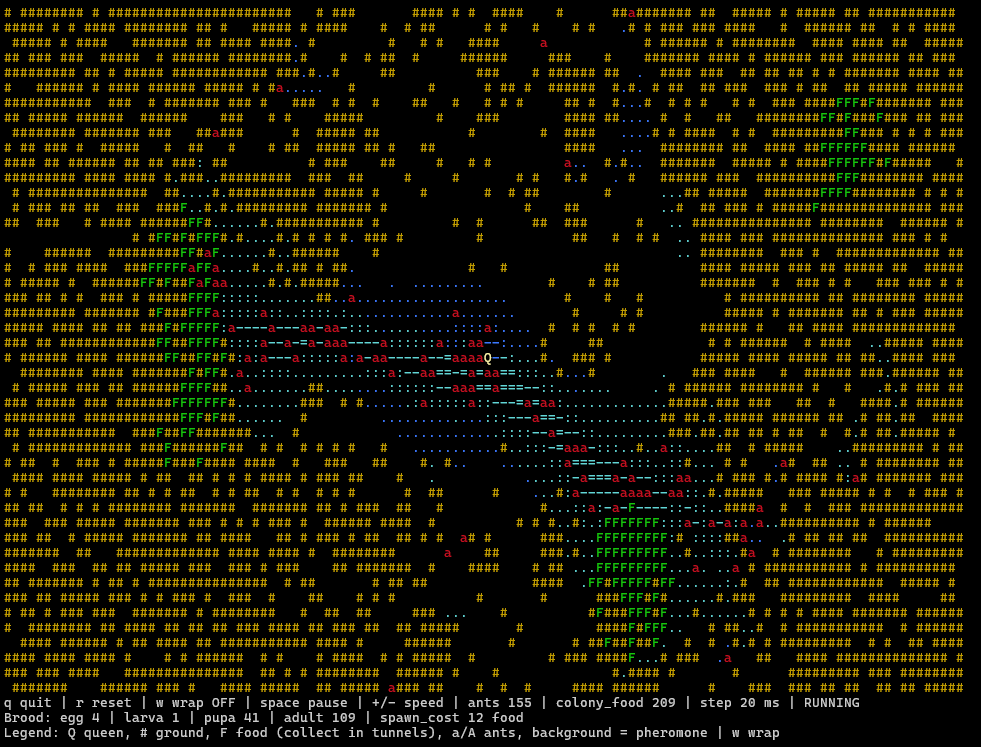

# Antcolony

Antcolony is a small Rust project that runs in your terminal. It renders an interactive antcolony experience in the console.



## Run

```sh
cargo run --release
```

## Controls

- Q: Quit
- R: Reset world
- Space: Toggle pause
- W: Toggle wrap
- + / =: Decrease step ms
- -: Increase step ms
