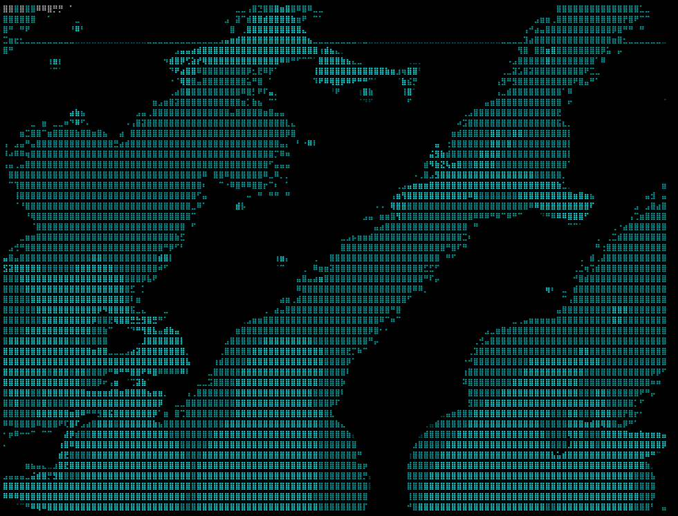

# Aquarium

Aquarium is a small Rust project that runs in your terminal. It renders an interactive aquarium experience in the console.



## Run

```sh
cargo run --release
```

## Controls

- Q: quit
- C: cycle theme
- P: pause/resume
- H: toggle HUD
- ?: toggle this help
- +/-: add/remove fish
- B: toggle bubbles
- F: feed (fish dart toward food)
- Left/Right: adjust current, 0 resets
