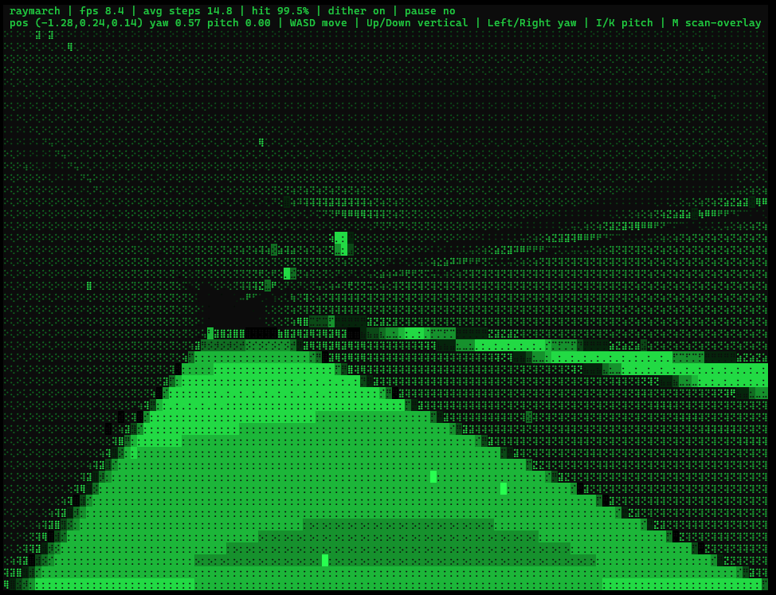

# Ascii Raymarch

Ascii Raymarch is a small Rust project that runs in your terminal. It renders an interactive ascii raymarch experience in the console.



## Run

```sh
cargo run --release
```

## Controls

- Q / Esc: Quit
- Space: Toggle pause
- R: Reseed
- T: Toggle trails
- N: Toggle nbody
- C: Increase theme idx
- + / =: Min
- - / _: Max
- ]: Min
- [: Max
