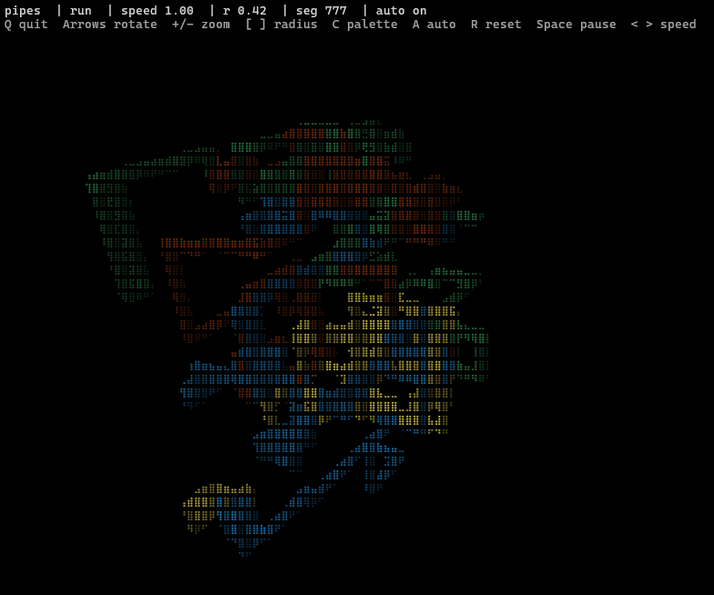

# Pipes

Pipes is a small Rust project that runs in your terminal. It renders an interactive pipes experience in the console.



## Run

```sh
cargo run --release
```

## Controls

- Q: Quit
- C: Cycle palette
- A: Toggle auto color
- H: Toggle HUD
- R: Reset
- Space: Toggle pause
- Up: Decrease pitch
- Down: Increase pitch
- Left: Decrease yaw
- Right: Increase yaw
- + / =: Decrease dist
- -: Increase dist
- ]: Increase pipe radius
- [: Decrease pipe radius
- < / ,: Max
- > / .: Min
- Ctrl+L: Reset
