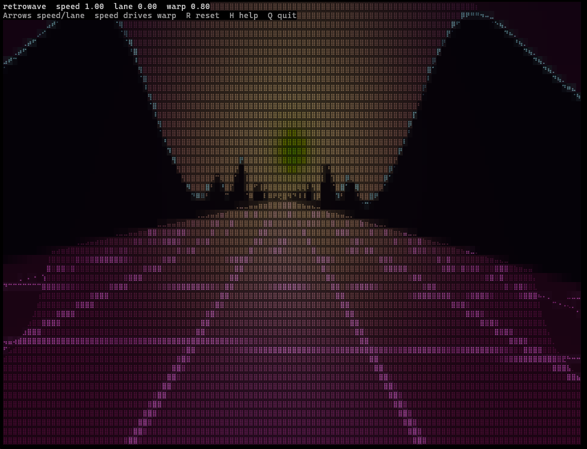

# Retrowave

Retrowave is a small Rust project that runs in your terminal. It renders an interactive retrowave experience in the console.



## Run

```sh
cargo run --release
```

## Controls

- Q / Esc: Quit
- H: Toggle help
- Up: Increase speed target
- Down: Decrease speed target
- Left: Decrease lane target
- Right: Increase lane target
- R: Reset lane target
- Ctrl+C: Quit
