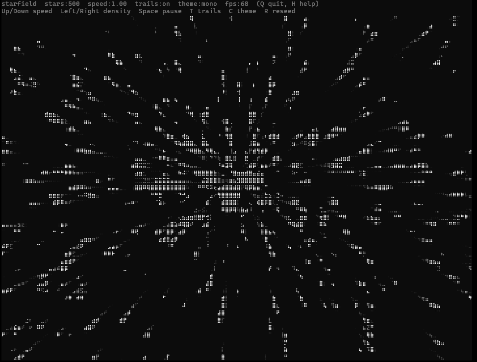

# Starfield

Starfield is a small Rust project that runs in your terminal. It renders an interactive starfield experience in the console.



## Run

```sh
cargo run --release
```

## Controls

- Q / Esc      Quit
- Space        Pause
- Up/Down      Speed
- Left/Right   Star count
- T            Trails
- C            Cycle theme
- R            Reseed
- H            Toggle this overlay
