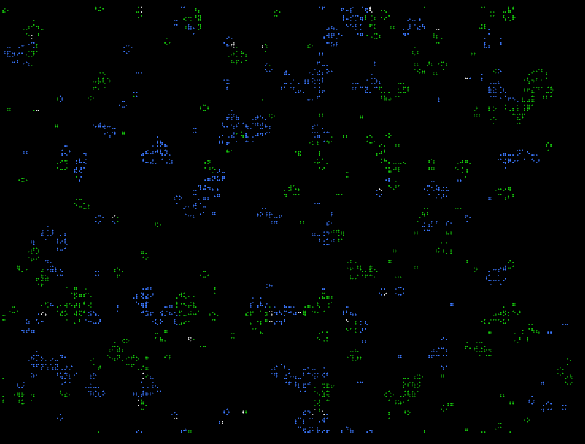

# Terrarium Braille

Terrarium Braille is a small Rust project that runs in your terminal. It renders an interactive terrarium braille experience in the console.



## Run

```sh
cargo run --release
```

## Controls

- Q: Quit
- R: Reseed
- C: _ => {}
